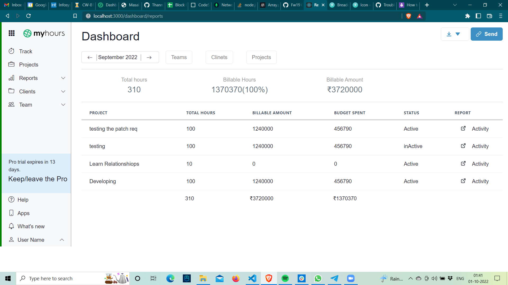
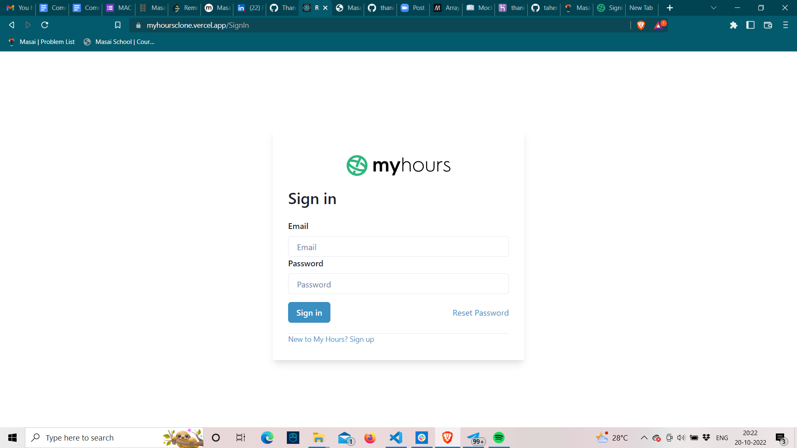

# [Myhours | Original](https://myhours.com/)

<table>
<tr>
<td>
We were a team of 5 from the Masai Web-18 batch who worked on cloning the Myhours website as part of our Unit-5 construct week. As a team, we were given a project to clone the Myhours website. Our project demonstrates a basic flow of  project managment app which allows you to track the progress of the project, where you can also restrict the budget spent on the project, breakdown projects into smaller and simpler tasks and also how much time one spent on each task . (Basically you can track the progress of project and the employess also).
</td>
</tr>
<tr>
<td>
My Hours is a cloud-based time tracking solution best suited for small teams and freelancers. Users can start time tracking on unlimited projects and tasks in seconds, generate insightful reports, and create invoices.
</td>
</tr>
</table>

## Myhours Clone

### Dashboard Page



### Signin Page



## [Getting Started]

## Run Locally

Clone the project

```bash
  git clone https://github.com/Thannzz/Myhours-Clone
```

Go to the project directory

```bash
  cd frontend
```

Install dependencies

```bash
  npm install
```

Start the localhost server

```bash
  npm start
```

## Built with

- REACT
- REDUX
- CHAKRA UI
- EXPRESS
- MONGO DB

## Creators

- [@Anshul Singla](https://github.com/Anshul-Singla)
- [@Thanigaivel](https://github.com/Thannzz)
- [@Abrar Aalam](https://github.com/Abrar2003)
- [@Onkar Deshmukh](https://github.com/Onkar271998)
- [@Sukhdev Hansda](https://github.com/imsukhdevhansda)
